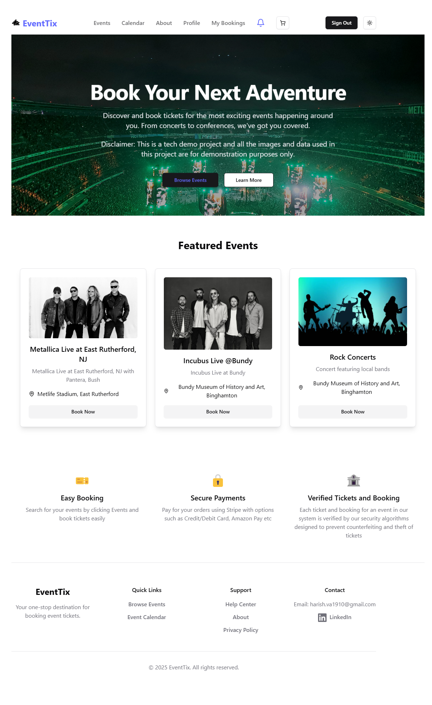

# EventTix

An event ticketing system serving small to medium business-owners in the US to create and manage local music events with ticketing and bookings. Ideal for music bars, hotels, community halls, amphitheaters and small artists to be discovered outside the local community. 
Visit here: [EventTix](https://eventix.website)

To know more about the tech stack used, [click here](https://eventix.website/about)

## Features

* Create and manage events by organisers with secure ticketing and booking processes, preventing frauds and increasing paying customers
* Book tickets to events and manage bookings as a customer with secure QR codes for checking in the events
* No third-party advertisements and selling personal data of users
* Booking limits and rate limits to prevent scalpers from hoarding tickets to ensure fair pricing for customers and organisers
* User-friendly interface with secure backend processing to ensure best customer and event organiser's experience
* Stripe payments for ticket booking with upcoming feature to enable/disable online payments depending upon organisers request.

## System Design

## Screenshots

